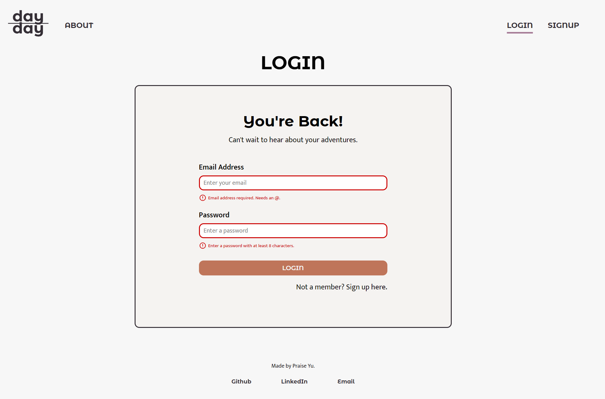
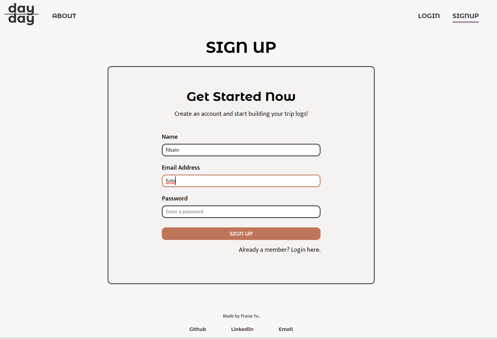

# Day by Day

Day by Day is a digital photo journal app that integrates photos and text entries to create a rich, immersive memory-keeping experience. This app allows users to upload photos from their trips and add snippets of text that provide context and details to daily entries.

While traveling, it's easy to take photos or jot down memories in a journal. However, simply scrolling through old photos or re-reading journal entries often fails to fully capture the experience. Photo journals combine visuals with contextual text, offering an immersive way to revisit your travels and memories more vividly than a photo or written journal entry alone.

This app is designed for travelers who want to remember what they saw, ate, drank, and where they went on specific days during their trips. It’s perfect for those who don't want to spend a lot of time making a physical scrapbook or writing in a journal but still want a comprehensive log of their travels.


## Features

- **User Authentication:** Securely sign up and log in to access and manage your personal journal.
- **Photo Uploads:** Easily upload photos from your trips to cloud storage to create visual entries.
- **Daily Entries** Organize your journal by days, creating a comprehensive log of your travels.
- **Customizable Styles** Personalize your entries with custom border colors, text colors, and border widths.
- **Edit Entries** Quickly view and edit your entries to keep your journal up to date.


## Installation


## Prerequisites

Before you begin, ensure you have met the following requirements:

- You have installed Node.js and npm.
- You have a .env file with the necessary environment variables (e.g., PORT, DB, CORS, CLOUDINARY, JWT_SECRET).

## Installation

Follow these steps to set up and run the project locally.

1. **Clone the repository**

```bash
git clone https://github.com/your-username/day-to-day-client.git
cd day-to-day-client
```

2. **Install dependencies**

```bash
npm install
```

3. **Set up environment variables**

Create a `.env` file in the root directory and add your environment variables:

```plaintext
VITE_LOCALHOST=http://your-api-url
```

4. **Run the application**

To start the development server, run:

```bash
npm run dev
```

To build the application for production, run:

```bash
npm run build
```

To preview the production build, run:

```bash
npm run preview
```

5. **Lint the code**

To lint the code, run:

```bash
npm run lint
```


## License

[MIT](https://choosealicense.com/licenses/mit/)


## API Reference

#### Sign up

```http
  POST /api/signup
```

| Parameter  | Type     | Description                          |
| :--------- | :------- | :----------------------------------- |
| `email`    | `string` | **Required**. User's email           |
| `name`     | `string` | **Required**. User's name            |
| `password` | `string` | **Required**. Password (min 8 chars) |

#### Log in

```http
  POST /api/login
```

| Parameter  | Type     | Description                          |
| :--------- | :------- | :----------------------------------- |
| `email`    | `string` | **Required**. User's email           |
| `password` | `string` | **Required**. Password (min 8 chars) |

#### Get user profile

```http
  GET /api/profile
```

**Requires authentication**

#### Get all trips

```http
  GET /api/trips
```

**Requires authentication**

#### Create a new trip

```http
  POST /api/trips
```

| Parameter    | Type     | Description                                 |
| :----------- | :------- | :------------------------------------------ |
| `trip_name`  | `string` | **Required**. Name of the trip              |
| `start_date` | `string` | **Required**. Start date (format: YYYY-MM-DD) |
| `end_date`   | `string` | End date (format: YYYY-MM-DD)               |

**Requires authentication**

#### Get trip by ID

```http
  GET /api/trips/${tripId}
```

| Parameter | Type     | Description                    |
| :-------- | :------- | :----------------------------- |
| `tripId`  | `string` | **Required**. ID of the trip   |

**Requires authentication**

#### Delete trip by ID

```http
  DELETE /api/trips/${tripId}
```

| Parameter | Type     | Description                    |
| :-------- | :------- | :----------------------------- |
| `tripId`  | `string` | **Required**. ID of the trip   |

**Requires authentication**

#### Get entries by trip ID

```http
  GET /api/entries/${tripId}
```

| Parameter | Type     | Description                    |
| :-------- | :------- | :----------------------------- |
| `tripId`  | `string` | **Required**. ID of the trip   |

**Requires authentication**

#### Get entry

```http
  GET /api/entries/${tripId}/${entryDate}
```

| Parameter    | Type     | Description                    |
| :----------- | :------- | :----------------------------- |
| `tripId`     | `string` | **Required**. ID of the trip   |
| `entryDate`  | `string` | **Required**. Date of the entry |

**Requires authentication**

#### Add a new entry

```http
  POST /api/entries/${tripId}/${entryDate}
```

| Parameter    | Type     | Description                    |
| :----------- | :------- | :----------------------------- |
| `tripId`     | `string` | **Required**. ID of the trip   |
| `entryDate`  | `string` | **Required**. Date of the entry |

**Requires authentication**

#### Edit an entry

```http
  PUT /api/entries/${tripId}/${entryDate}
```

| Parameter    | Type     | Description                    |
| :----------- | :------- | :----------------------------- |
| `tripId`     | `string` | **Required**. ID of the trip   |
| `entryDate`  | `string` | **Required**. Date of the entry |

**Requires authentication**

#### Upload a photo

```http
  POST /api/${tripId}/${entryDate}/photos
```

| Parameter    | Type     | Description                     |
| :----------- | :------- | :------------------------------ |
| `tripId`     | `string` | **Required**. ID of the trip    |
| `entryDate`  | `string` | **Required**. Date of the entry |
| `image`      | `file`   | **Required**. Image file        |

**Requires authentication**

#### Get photos

```http
  GET /api/${tripId}/${entryDate}/photos
```

| Parameter    | Type     | Description                     |
| :----------- | :------- | :------------------------------ |
| `tripId`     | `string` | **Required**. ID of the trip    |
| `entryDate`  | `string` | **Required**. Date of the entry |

**Requires authentication**

#### Delete a photo

```http
  DELETE /api/${tripId}/${entryDate}/photos
```

| Parameter    | Type     | Description                     |
| :----------- | :------- | :------------------------------ |
| `tripId`     | `string` | **Required**. ID of the trip    |
| `entryDate`  | `string` | **Required**. Date of the entry |
| `public_id`  | `string` | **Required**. Public ID of the photo |

**Requires authentication**

#### Upload text

```http
  POST /api/${tripId}/${entryDate}/text
```

| Parameter    | Type     | Description                     |
| :----------- | :------- | :------------------------------ |
| `tripId`     | `string` | **Required**. ID of the trip    |
| `entryDate`  | `string` | **Required**. Date of the entry |
| `description`| `string` | **Required**. Description text  |

**Requires authentication**

#### Get text

```http
  GET /api/${tripId}/${entryDate}/text
```

| Parameter    | Type     | Description                     |
| :----------- | :------- | :------------------------------ |
| `tripId`     | `string` | **Required**. ID of the trip    |
| `entryDate`  | `string` | **Required**. Date of the entry |

**Requires authentication**
```
##Environment Variables

To run this project, you will need to add the following environment variables to your .env file.

`VITE_LOCALHOST`= http://localhost:8080


## Acknowledgements

 - [Awesome Readme Templates](https://awesomeopensource.com/project/elangosundar/awesome-README-templates)
 - [Awesome README](https://github.com/matiassingers/awesome-readme)
 - [How to write a Good readme](https://bulldogjob.com/news/449-how-to-write-a-good-readme-for-your-github-project)


## Tech Stack

- React
- Vite
- Axios
- Sass
- React Router
- React Grid Layout
- React Dropzone
- React Colorful
- React Modal

## Screenshots




