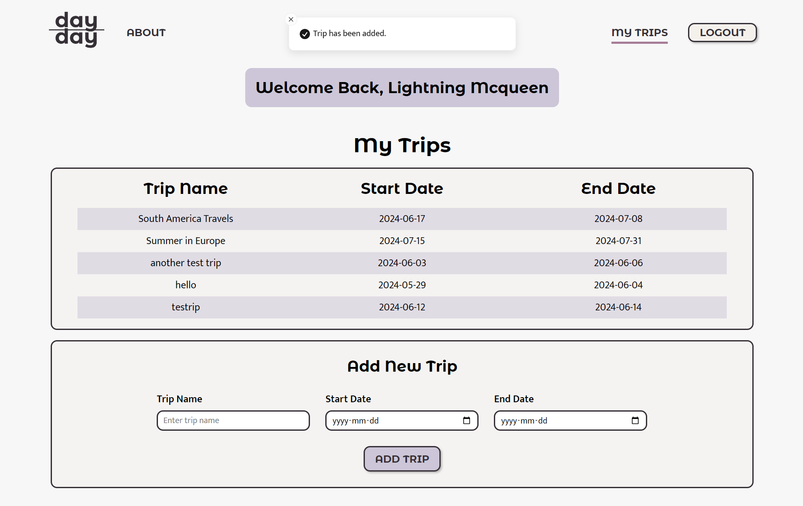

# Day by Day

Day by Day is a digital photo journal app that integrates photos and text entries to create a rich, immersive memory-keeping experience. This app allows users to upload photos from their trips and add snippets of text that provide context and details to daily entries.

While traveling, it's easy to take photos or jot down memories in a journal. However, simply scrolling through old photos or re-reading journal entries often fails to fully capture the experience. Photo journals combine visuals with contextual text, offering an immersive way to revisit your travels and memories more vividly than a photo or written journal entry alone.

This app is designed for travelers who want to remember what they saw, ate, drank, and where they went on specific days during their trips. It’s perfect for those who don't want to spend a lot of time making a physical scrapbook or writing in a journal but still want a comprehensive log of their travels.


## Features

- **User Authentication:** Securely sign up and log in to access and manage your personal journal.
- **Photo Uploads:** Easily upload photos from your trips to cloud storage to create visual entries.
- **Daily Entries** Organize your journal by days, creating a comprehensive log of your travels.
- **Customizable Styles** Personalize your entries with custom border colors, text colors, and border widths.
- **Edit Entries** Quickly view and edit your entries to keep your journal up to date.


## Installation


## Prerequisites

Before you begin, ensure you have met the following requirements:

- You have installed Node.js and npm.
- You have a .env file with the necessary environment variables (e.g., PORT, DB, CORS, CLOUDINARY, JWT_SECRET).

## Installation

Follow these steps to set up and run the project locally.

1. **Clone the repository**

```bash
git clone https://github.com/your-username/day-to-day-client.git
cd day-to-day-client
```

2. **Install dependencies**

```bash
npm install
```

3. **Set up environment variables**

Create a `.env` file in the root directory and add your environment variables:

```plaintext
VITE_LOCALHOST=http://your-api-url
```

4. **Run the application**

To start the development server, run:

```bash
npm run dev
```

To build the application for production, run:

```bash
npm run build
```

To preview the production build, run:

```bash
npm run preview
```

5. **Lint the code**

To lint the code, run:

```bash
npm run lint
```


## License

[MIT](https://choosealicense.com/licenses/mit/)


## API Reference

#### Sign up

```http
  POST /api/signup
```

| Parameter  | Type     | Description                          |
| :--------- | :------- | :----------------------------------- |
| `email`    | `string` | **Required**. User's email           |
| `name`     | `string` | **Required**. User's name            |
| `password` | `string` | **Required**. Password (min 8 chars) |

#### Log in

```http
  POST /api/login
```

| Parameter  | Type     | Description                          |
| :--------- | :------- | :----------------------------------- |
| `email`    | `string` | **Required**. User's email           |
| `password` | `string` | **Required**. Password (min 8 chars) |

#### Get user profile

```http
  GET /api/profile
```

**Requires authentication**

#### Get all trips

```http
  GET /api/trips
```

**Requires authentication**

#### Create a new trip

```http
  POST /api/trips
```

| Parameter    | Type     | Description                                 |
| :----------- | :------- | :------------------------------------------ |
| `trip_name`  | `string` | **Required**. Name of the trip              |
| `start_date` | `string` | **Required**. Start date (format: YYYY-MM-DD) |
| `end_date`   | `string` | End date (format: YYYY-MM-DD)               |

**Requires authentication**

#### Get trip by ID

```http
  GET /api/trips/${tripId}
```

| Parameter | Type     | Description                    |
| :-------- | :------- | :----------------------------- |
| `tripId`  | `string` | **Required**. ID of the trip   |

**Requires authentication**

#### Delete trip by ID

```http
  DELETE /api/trips/${tripId}
```

| Parameter | Type     | Description                    |
| :-------- | :------- | :----------------------------- |
| `tripId`  | `string` | **Required**. ID of the trip   |

**Requires authentication**

#### Get entries by trip ID

```http
  GET /api/entries/${tripId}
```

| Parameter | Type     | Description                    |
| :-------- | :------- | :----------------------------- |
| `tripId`  | `string` | **Required**. ID of the trip   |

**Requires authentication**

#### Get entry

```http
  GET /api/entries/${tripId}/${entryDate}
```

| Parameter    | Type     | Description                    |
| :----------- | :------- | :----------------------------- |
| `tripId`     | `string` | **Required**. ID of the trip   |
| `entryDate`  | `string` | **Required**. Date of the entry |

**Requires authentication**

#### Add a new entry

```http
  POST /api/entries/${tripId}/${entryDate}
```

| Parameter    | Type     | Description                    |
| :----------- | :------- | :----------------------------- |
| `tripId`     | `string` | **Required**. ID of the trip   |
| `entryDate`  | `string` | **Required**. Date of the entry |

**Requires authentication**

#### Edit an entry

```http
  PUT /api/entries/${tripId}/${entryDate}
```

| Parameter    | Type     | Description                    |
| :----------- | :------- | :----------------------------- |
| `tripId`     | `string` | **Required**. ID of the trip   |
| `entryDate`  | `string` | **Required**. Date of the entry |

**Requires authentication**

#### Upload a photo

```http
  POST /api/${tripId}/${entryDate}/photos
```

| Parameter    | Type     | Description                     |
| :----------- | :------- | :------------------------------ |
| `tripId`     | `string` | **Required**. ID of the trip    |
| `entryDate`  | `string` | **Required**. Date of the entry |
| `image`      | `file`   | **Required**. Image file        |

**Requires authentication**

#### Get photos

```http
  GET /api/${tripId}/${entryDate}/photos
```

| Parameter    | Type     | Description                     |
| :----------- | :------- | :------------------------------ |
| `tripId`     | `string` | **Required**. ID of the trip    |
| `entryDate`  | `string` | **Required**. Date of the entry |

**Requires authentication**

#### Delete a photo

```http
  DELETE /api/${tripId}/${entryDate}/photos
```

| Parameter    | Type     | Description                     |
| :----------- | :------- | :------------------------------ |
| `tripId`     | `string` | **Required**. ID of the trip    |
| `entryDate`  | `string` | **Required**. Date of the entry |
| `public_id`  | `string` | **Required**. Public ID of the photo |

**Requires authentication**

#### Upload text

```http
  POST /api/${tripId}/${entryDate}/text
```

| Parameter    | Type     | Description                     |
| :----------- | :------- | :------------------------------ |
| `tripId`     | `string` | **Required**. ID of the trip    |
| `entryDate`  | `string` | **Required**. Date of the entry |
| `description`| `string` | **Required**. Description text  |

**Requires authentication**

#### Get text

```http
  GET /api/${tripId}/${entryDate}/text
```

| Parameter    | Type     | Description                     |
| :----------- | :------- | :------------------------------ |
| `tripId`     | `string` | **Required**. ID of the trip    |
| `entryDate`  | `string` | **Required**. Date of the entry |

**Requires authentication**
```
```
##Environment Variables

To run this project, you will need to add the following environment variables to your .env file.

`VITE_LOCALHOST`= http://localhost:8080


## Tech Stack

- React
- Vite
- Axios
- Sass
- React Router
- React Grid Layout
- React Dropzone
- React Colorful
- React Modal

## Screenshots

### Login Page
Login Page with error states shown when user does not enter the correct information.


### Signup Page
Signup Page showing active state when user clicks into the textbox. 


### Dashboard (My Trips Page)
My Trips Page shows the user's name when logged in, the list of trips that they want to create logs for, and an add trip form below to add a new trip. There is also a logout button when a user is signed in so they can log out.


### Dashboard (My Trips Page) - Validation & Hover Effect
On the My Trips Page, it shows the hover effect when hovering over a trip as well as the form validation on the add trip form.


### Dashboard (Toasts)
When a new trip is added, a toast pops up alerting the user to the new trip and the new trip is displayed in the list.


### Trip Details Page 
When a trip is clicked on, it takes the user to the Trip Details Page. This displays a list of all the days on their trip, if the user has submitted a log for that day yet, and a corresponding add/edit button so the user can create or update their entry. The title is highlighted at the top in purple and the option to go back to the My Trips Page is available as well as the Delete Trips button.


### Trip Details Page (Delete Trips Functionality)
On the trip details page, when the delete button is pressed, a modal will pop up asking the user to confirm if they want to delete this trip or not. When clicked, the trip & its corresponding data is deleted from the database & photos from cloudinary. A toast notification will inform the user when a trip is deleted. 


### Add Entry Page (Uploading Photos)
When a user clicks the add entry button, they are taken to this layout, where they can click on tabs to add a daily log. The photos tab lets users upload photos to the layout. When a photo is uploaded, a preview of the image will display and the option to upload or cancel is available.


Once uploaded, the photo will display in a gallery in the bottom of the tab as part of Today's Photos and it will be rendered onto the "journal page" as well. The buttons become a "New Upload" button and a disabled button that says "Uploaded". 


When a photo is being uploaded, an "uploading..." toast will pop up and notify the user when the upload is complete.


### Add Entry Page (Add Text & Move Items)
When the Text tab is clicked, it takes the user to the upload text function where they can type in anything and it will be added to the entry. The photos and text blocks can also be resized and moved anywhere on the "journal pages".


### Add Entry Page (Design Tab)
On the design tab, the user can customize the text colour, border colour of the photos, and the border width of the photos. When the colour swatch is clicked on, a colour picker will pop up and the user can choose any colour. Clicking outside of the colour picker closes it. The same functionality applies to the border colour option. 


When customizing colours and border width, once the user has selected different values, a reset button will appear, allowing the user to revert the values back to the default colours and a border width of 0.


### Add Entry Page (Save Photo Toast, Entry List Updated)
When the user clicks on save entry, the layout of the text & photos is saved. A toast will pop up informing the user of the successful entry save and then redirect them back to the Trip Details Page for that specific trip.


The user gets redirected to the entry list after saving a new entry and the status for that day changes, informing the user that they have added an entry for that day already. Now they have the option to edit a previously saved entry or add a new entry for a different day. 
